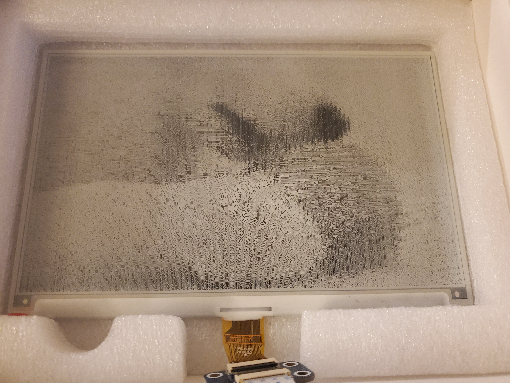
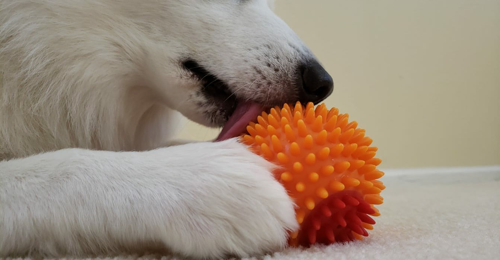

# Digital Photo Frame

Raspberry Pico W with Waveshare 7.5 in epaper (black/white)

  
   

## Hardware Setup
- https://www.waveshare.com/wiki/Pico-ePaper-7.5 

## Micropython
- https://micropython.org/download/rp2-pico/ (alternatively use Thonny)

## Image Prep (Gimp)
- Resize Images to 800x480
- Image -> Mode -> Indexed... 
- Use black and white (1-bit) palette 
- Color dithering - Floyd-Steinberg (normal)
- Save as pbm

## Steps to use
- Run img_gen.py on pbm file (breaks image into small chunks to avoid memory allocation errors)
- Run disp.py on pico 

## Features coming soon (aka in 3 months hopefully) 
- Multiple Images
- Google Photos support 

## References 
- https://www.mfitzp.com/displaying-images-oled-displays/ 